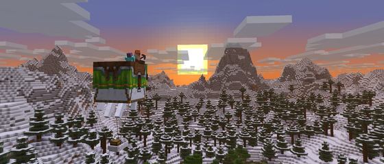

## The server has been updated to 1.21.6

## Additions:

* **Happy Ghast:** A new mountable flying mob that can carry up to four players.
* **Dried Ghast Block:** A new block found in Nether Fossil structures; placing it in water can lead to the spawning of Ghastlings, which can be tamed and eventually become Happy Ghasts.
* **Harness:** A new item equipped on a Happy Ghast to allow players to ride it. It comes in 16 colors and is crafted from 3 Leather, 2 Glass blocks, and 1 Wool block.
* **Locator Bar:** A new HUD element that shows the direction of other players in multiplayer.
* **New Music Disc "Tears":** By Amos Roddy, obtainable by killing a Ghast with a Fireball deflected by a Player.
* **5 New Music Tracks:** Also by Amos Roddy.
* **New Advancements:**
    * "Stay Hydrated!" (Husbandry): Unlocked when a Dried Ghast block is placed into water.
    * "Heart Transplanter" (Adventure): Unlocked when a player places a Creaking Heart with the correct alignment between two Pale Oak Log blocks.
* **Old Spelling Indonesian (Indonesian pre-reform) and Cantabrian language support.**
* **Vibrant Visuals:** A graphical update for Bedrock Edition (coming later to Java Edition) that includes updated textures, more realistic water, and dynamic lighting with pixel-accurate shadows.
* **New sound for when a Lead snaps.**
* **New custom sounds for shearing Saddles, Horse Armor, and Carpets from Llamas.**
* **New sound volume category "UI":** For sounds played by UI elements, like button clicks.
* **Music now plays even when the game is paused.**
* **Data Pack version is now 80.**
* **Resource Pack version is now 63.**
* **All JSON files (in worlds, packs, configuration, etc.) support comments.**
* **Pressing F3 + V now prints client-side version information.**
* **"Command Syntax" report now contains information about required permission level.**

### Please note that some plugins do not work!
