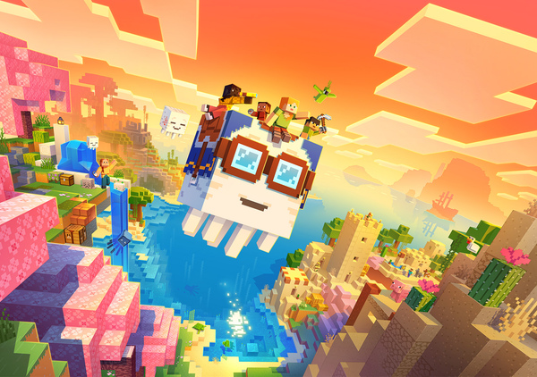

# Update #1

## :twemoji-check-mark-button: New Features & Enhancements

- Entities (other than the player) can now go through portals again

- The server has been bumped to the newest Paper build: [803baf0](https://github.com/PaperMC/Paper/commit/803baf0ba697630802f8b7a85666463e6092e6c0)

- Overall server stability & improvements

## :mdi-paperclip: Removals:

- Removed crates plugin (*no one was using it*)[^1]

- Removed plugin dependencies for the crates plugin

TNT Duping may return next update? :twemoji-eyes:

##### Custom Music Discs are coming soon!

And that's it! :twemoji-party-popper: Please stick around for future updates!

[^1]: Players were never going to be allowed to create crates. They were there for the sake of adding a fun new way to get items, which no one really cared for. Which is why it was removed.